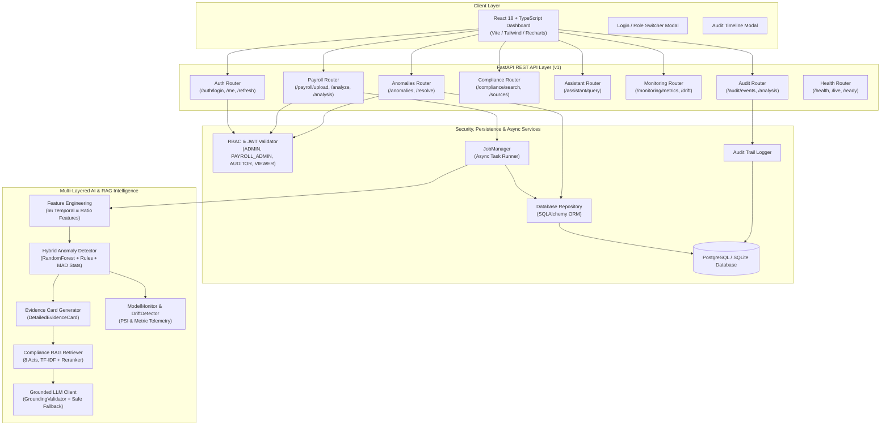

# 🛡️ AI Payroll Guardian
**Intelligent Enterprise Payroll Verification, Multi-Layered Anomaly Detection, Grounded Compliance RAG & Regulatory Audit Platform**

[](https://www.python.org/downloads/)
[](https://fastapi.tiangolo.com)
[](https://reactjs.org/)
[](LICENSE)
[](#-testing--validation)
[-brightgreen.svg)](#-capabilities--milestones-phases-1--10-complete)

---

## 📌 Problem Statement

Enterprise payroll processing handles millions of monthly disbursements across complex statutory frameworks (Provident Fund, ESI, TDS, State Professional Tax) and internal company policies. Traditional payroll software relies exclusively on rigid, static threshold rules or manual spot-checks:
- **Subtle Statutory Drifts**: Small unauthorized deduction reductions or calculation drifts evade static rules.
- **Cold-Start & Tenure Vulnerabilities**: New joiners lacking historical records trigger high false-alarm rates or slip past detection.
- **Complex Compound Fraud**: Ghost employees, collusion-based overtime inflation, and creeping unauthorized salary bumps remain hidden within normal aggregates.
- **Compliance Ambiguity**: When an anomaly is flagged, auditors lack immediate, grounded statutory citations to justify payroll holds.

---

## 💡 The Solution: Multi-Layered Hybrid AI + RAG Knowledge Grounding

AI Payroll Guardian introduces a production-hardened multi-pillar defense architecture:
1. **Machine Learning Anomaly Detectors**: Isolation Forests, Random Forests, and Gradient Boosting to detect subtle multi-dimensional tabular outliers.
2. **Deterministic Statutory & Arithmetic Rules**: Strict mathematical checks for bounds, reconciliation balance, and labor law compliance.
3. **Robust Statistical Signals**: Median Absolute Deviation (MAD) robust z-scores and cold-start observation depth tracking.
4. **Authoritative Compliance RAG**: Date-aware and jurisdiction-isolated retrieval of official government acts (EPFO, ESIC, Income Tax, State PT) and company SOPs with SHA-256 provenance hashes.
5. **Grounded LLM Explanations**: Zero-fabrication natural language audit cards and conversational assistant with strict anti-hallucination validation.
6. **Authentication & 4-Tier RBAC**: Signed JWT session authentication with role boundaries (`ADMIN`, `PAYROLL_ADMIN`, `AUDITOR`, `VIEWER`).
7. **Database Persistence & Audit History**: SQLAlchemy ORM persistence (PostgreSQL / SQLite) with an append-only immutable audit trail and anomaly sign-off workflows.
8. **Model Monitoring & Drift Telemetry**: Population Stability Index (PSI) tracking and operational telemetry.
9. **Auditor Web Dashboard**: Enterprise React 18 + TypeScript + Vite UI for real-time audit visualization.

---

## 🏛️ System Architecture



---

## 🚀 Capabilities & Milestones (Phases 1 → 10 Complete)

| Phase | Milestone | Core Highlights |
| :---: | :--- | :--- |
| **Phase 1** | **Synthetic Generation & Validation** | Scalable generation (10k dev, 2.4M main, 18M stress), 13 anomaly archetypes, and chunked streaming validation. |
| **Phase 2** | **Feature Engineering & Leakage Audit** | 66 temporal & ratio features with verified zero future-lookahead leakage. |
| **Phase 3** | **ML Model Comparison & FP/1k Metric** | Trained tabular ML models; achieved $0.3$ unique-employee false positives per 1,000 employees. |
| **Phase 4** | **Model Hardening & Hybrid V2** | Cold-start recall boosted to 100.0%, subtle PF errors from 6.8% to 87.0% using `HybridPayrollDetector_V2`. |
| **Phase 5** | **Payroll & Compliance RAG** | 100% Recall@1, 1.000 MRR, 3-tier authority weighting, date lifespan filtering, and traceable citations. |
| **Phase 6** | **Grounded LLM Explanations** | Natural language auditor explanation cards with zero-fabrication citation verification and deterministic fallback. |
| **Phase 7** | **Production FastAPI Backend** | Modular REST API service with Request-ID tracing, privacy-safe logging, and batch ingestion. |
| **Phase 8** | **Auditor Web Dashboard** | Enterprise React 18 + TypeScript + Vite audit dashboard with CSV/JSON ingestion, anomaly tables, and AI chat. |
| **Phase 9** | **Live End-to-End Integration** | Unified cross-layer service integration, multi-format CSV/Parquet uploads, stress benchmarks. |
| **Phase 10** | **Production Hardening & Release** | JWT authentication, 4-tier RBAC, persistent database, async jobs, drift telemetry, audit trail, hard-case validation. |

---

## 🗂️ Project Repository Structure

```
Payroll-Guardian/
├── app.py                       # User-facing backend startup entrypoint
├── backend/                     # Canonical FastAPI backend service layer
│   ├── api/                     # REST API routers (auth, payroll, anomalies, compliance, assistant, audit, monitoring, health)
│   ├── auth/                    # JWT tokens, password hashing & RBAC route guards
│   ├── database/                # SQLAlchemy ORM models, session & repository abstraction
│   ├── services/                # Business orchestration (analysis, detection, compliance, explanation, jobs, audit)
│   ├── schemas/                 # Pydantic domain models & request/response contracts
│   ├── dependencies/            # ModelManager & dependency injection providers
│   ├── middleware/              # Request-ID tracing & privacy-safe zero-PII logging
│   ├── config/                  # Centralized system and backend configuration
│   └── utils/                   # Security & file validation utilities
├── ai/                          # Machine learning & statistical intelligence layer
│   ├── detection/               # Anomaly detectors, rules, calibrators, hybrid engine
│   ├── features/                # 66 temporal, historical & cold-start features
│   ├── explainability/          # Structured evidence card & SHAP attribution
│   ├── llm/                     # Grounded explainer, safety filters & prompt defense
│   ├── monitoring/              # PSI drift detector, telemetry metric calculator & monitor
│   └── training/                # Multi-metric evaluator & threshold sweeps
├── rag/                         # Compliance RAG Knowledge System
│   ├── ingestion/               # Document loader, registry & deduplication
│   ├── retrieval/               # Vector store, hybrid reranker & retriever
│   ├── embeddings/              # Dense TF-IDF and SentenceTransformers embeddings
│   ├── chunking/                # Structural semantic chunker
│   └── citations/               # Auditable citation badge generator
├── frontend/                    # Enterprise React 18 + TypeScript + Vite Dashboard
├── data/                        # Datasets, benchmarks & statutory regulatory knowledge base
├── models/                      # Serialized model checkpoints & configs (v1 & v2)
├── experiments/                 # Experiment benchmark records & evaluation JSONs
├── scripts/                     # CLI execution scripts (benchmarks, data, training, backend)
├── tests/                       # Pytest unit & integration test suites (168 tests)
├── docker-compose.yml           # Multi-container orchestration (DB, API, Frontend)
├── requirements.txt             # Locked dependencies
├── LICENSE                      # MIT License
└── README.md                    # Project documentation
```

---

## 🚀 Quickstart & Setup

### 1. Installation
```bash
git clone https://github.com/Priyanshshukla2005/Payroll-Guardian.git
cd Payroll-Guardian

python -m venv .venv
# On Windows:
.venv\Scripts\activate
# On Linux/macOS:
source .venv/bin/activate

pip install -r requirements.txt
```

### 2. Start Backend API
```bash
python app.py
```
- **API Documentation (Swagger UI)**: `http://localhost:8000/docs`
- **Health Check**: `http://localhost:8000/api/v1/health`

### 3. Start Frontend Dashboard
```bash
cd frontend
npm install
npm run dev
```
- **Auditor Dashboard**: `http://localhost:5173`

### 4. Enterprise Docker Compose Deployment
```bash
docker-compose up --build
```
- **PostgreSQL Database**: Port `5432`
- **FastAPI Backend**: Port `8000`
- **React Frontend**: Port `3000`

---

## 🧪 Testing & Validation

Run the complete test suite across AI, Data, RAG, Backend, Auth, Database, and Integration layers:

```bash
# Complete Backend Test Suite (Python / Pytest — 191 tests)
python -m pytest -v

# Standalone End-to-End Phase 10 Verification Script (15-step workflow)
python scripts/e2e_phase10_verification.py

# Frontend Test Suite (React / Vitest — 10 tests)
cd frontend && npm test -- --run

# Frontend Production Build
cd frontend && npm run build
```

---

## 🔒 Limitations & Ethical Disclaimer

> [!WARNING]
> - **SYNTHETIC DATA**: The current models are trained on realistic synthetic datasets designed to replicate Indian enterprise payroll behaviors.
> - **DECISION SUPPORT ONLY**: AI Payroll Guardian serves as an auditor decision-support tool. It flags discrepancies and provides regulatory citations; all final payroll disbursements remain subject to authorized human audit.
