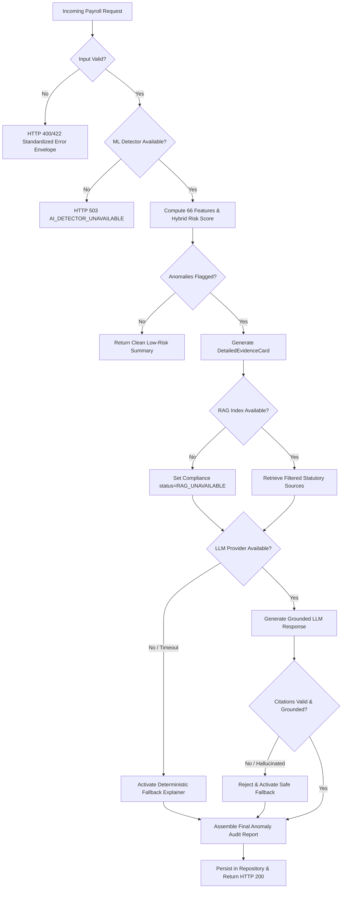

# 🏛️ AI Payroll Guardian — Complete System Architecture (Phase 9)

**Version**: `v2.0.0-production-hardened`  
**Date**: August 2026  
**Status**: COMPLETE, HARDENED & VERIFIED  

---

## 1. 🏗️ End-to-End System Pipeline

```
                    USER / AUDITOR
                         ↓
                  REACT FRONTEND
             (TypeScript, Vite, Recharts)
                         ↓
                 FASTAPI BACKEND
            (Request-ID, PII-Safe Logger)
                         ↓
                 INPUT VALIDATION
        (File/JSON Security & Bounds Check)
                         ↓
                PAYROLL NORMALIZATION
            (Data Alignment & Sanitization)
                         ↓
                 66 ML FEATURES
         (Cold-Start, Ratios, Temporal)
                         ↓
                HYBRID AI DETECTOR
       (Ensemble + Rule Engine Risk Score)
                         ↓
               DETAILED EVIDENCE CARD
        (Signals, Deviations, Violations)
                         ↓
              COMPLIANCE RAG RETRIEVER
         (Jurisdiction & Date Filtered)
                         ↓
              APPLICABLE LEGAL SOURCES
           (EPFO, ESIC, Tax, Wage Acts)
                         ↓
                GROUNDED LLM ENGINE
         (Prompt Masking + Structured XML)
                         ↓
             GROUNDED AUDIT EXPLANATION
        (Actions, Severity, Reason, Policy)
                         ↓
               RESPONSE VALIDATOR
       (Hallucination & Citation Verifier)
                         ↓
                 FASTAPI RESPONSE
        (Standard JSON with Observability)
                         ↓
                  REACT FRONTEND
        (Tables, Charts, Evidence Modals)
                         ↓
                    USER / AUDITOR
```

---

## 2. 🛡️ Failure Paths & Resilience Architecture



---

## 3. 🧩 Component Taxonomy & Responsibilities

| Layer / Component | Location | Implementation Status | Core Responsibility |
| :--- | :--- | :---: | :--- |
| **Startup Entrypoint** | `app.py` | **COMPLETE** | Canonical user-facing startup wrapper launching Uvicorn (`python app.py`). |
| **Backend & API** | `backend/` | **COMPLETE** | Modular FastAPI service, Request-ID tracing, PII-safe access logs, standardized error envelopes, health endpoints (`/health`, `/liveness`, `/readiness`). |
| **Data Pipeline** | `data_pipeline/` | **COMPLETE** | High-performance generation (10k dev, 2.4M main, 18M stress), streaming batching, anomaly injection, and hard-case synthesis. |
| **Feature Engineering** | `ai/features/` | **COMPLETE** | 66 engineered temporal, historical, ratio, and statistical features with zero lookahead data leakage. |
| **AI/ML Detection** | `ai/detection/` | **COMPLETE** | Ensemble scoring (`XGBoost`, `LightGBM`, `IsolationForest`, `Autoencoder`, `EnhancedRuleDetector`), multi-label classification, and `HybridPayrollDetector_V2`. |
| **Explainability** | `ai/explainability/` | **COMPLETE** | Builds structured `DetailedEvidenceCard` containing top signals, rule violations, peer and historical comparisons. |
| **Compliance RAG** | `rag/` | **COMPLETE** | Authority-weighted RAG retriever, semantic chunker, vector store index, date/jurisdiction pre-filtering, and citation generator. |
| **Grounded LLM** | `ai/llm/` | **COMPLETE** | Strict JSON schema enforcement, citation verification, prompt injection defense, conversational QA assistant, and deterministic fallback. |
| **React Frontend** | `frontend/` | **COMPLETE** | Modern audit dashboard, CSV/JSON upload, searchable anomaly tables, deep evidence panels, compliance explorer, and grounded assistant chat. |
| **Integration Suites** | `tests/integration/` | **COMPLETE** | End-to-end integration happy path, failure paths, data integrity, scenario matrix (8 scenarios), and concurrency tests. |
| **Pre-Flight Scripts** | `scripts/` | **COMPLETE** | Standalone pre-flight smoke test (`scripts/smoke_test.py`), interactive demo (`scripts/demo.py`), and performance benchmarks (`scripts/backend/benchmark_phase9.py`). |

---

## 4. 📊 Observability & Performance Timings

Every analysis response embeds granular pipeline execution metrics without logging sensitive payroll payloads:

```json
{
  "request_id": "req_05d93c3e489c4f7a96e45ff636dc8d6f",
  "analysis_id": "anl_6d830e631f594bcf86f8c5c4192ba4b8",
  "status": "COMPLETED",
  "payroll_period": "2024-06",
  "model_version": "HybridPayrollDetector_V2",
  "duration_ms": 283.19,
  "timings": {
    "feature_generation_ms": 23.59,
    "detection_ms": 256.26,
    "rag_ms": 1.04,
    "llm_ms": 2.00,
    "total_ms": 283.19
  }
}
```

---

## 5. 🛡️ Architectural Invariants & Production Guardrails

1. **Strict Service Decoupling**: Frontend communicates exclusively via REST API endpoints (`/api/v1/*`) and never invokes models or vector stores directly.
2. **Deterministic Fallbacks**: System never crashes or fails silently when external LLM or RAG services are offline; it falls back to verified deterministic rules.
3. **Zero-Fabrication Citation**: LLM is constrained to cite only chunks retrieved and verified by `PayrollRAGRetriever`.
4. **No LLM Detection**: Anomaly risk scores are computed strictly by `HybridPayrollDetector_V2`, never by the LLM.
5. **Zero PII Exposure**: Backend logs and client errors never leak national IDs, salaries, or internal code pointers.
